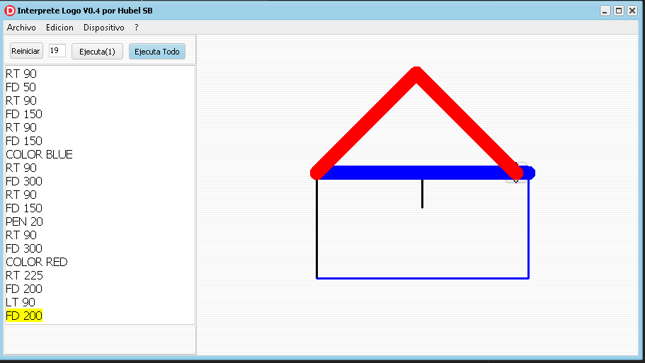

# 🐢 Intérprete LOGO – TurtleUNAS

Intérprete del lenguaje **LOGO** desarrollado con fines **educativos**, orientado a la enseñanza de programación básica, geometría y pensamiento algorítmico mediante **gráficos de tortuga**.

Este proyecto ha sido desarrollado para ser utilizado por **estudiantes**, permitiéndoles experimentar con instrucciones simples de dibujo, movimiento y color.

---

## 📸 Captura



---

## 🎯 Objetivo del proyecto

El objetivo principal es proporcionar una herramienta sencilla para que los alumnos puedan:

- Comprender la ejecución **secuencial de instrucciones**
- Aprender conceptos básicos de **geometría**
- Introducirse a la programación de forma **visual**
- Experimentar con gráficos sin complejidad técnica inicial

---

## ✨ Características

- 🐢 Gráficos tipo *Turtle Graphics*
- ➡️ Comandos básicos de movimiento (`FD`, `RT`, `LT`)
- 🎨 Manejo de colores
- ✏️ Control del grosor del lápiz
- ▶️ Ejecución paso a paso o completa
- 📦 Ejecutables **precompilados listos para usar**

---

## 🧩 Comandos disponibles

| Comando | Descripción |
|------|------------|
| `FD n` | Avanza `n` unidades |
| `RT n` | Gira `n` grados a la derecha |
| `LT n` | Gira `n` grados a la izquierda |
| `COLOR nombre` | Cambia el color del trazo |
| `PEN n` | Cambia el grosor del lápiz |

📌 *Actualmente no se incluyen bucles ni procedimientos, manteniendo el enfoque introductorio.*

---

## 📂 Estructura del proyecto

```text
├── DIST/            # Ejecutables precompilados (listos para usar)
├── imagenes/        # Recursos gráficos
├── captura.png      # Imagen principal del proyecto
├── README.md        # Documentación
├── TurtleUNAS.dpr   # Proyecto Delphi
├── uMain.pas        # Código fuente principal
├── uMain.dfm        # Formulario principal
